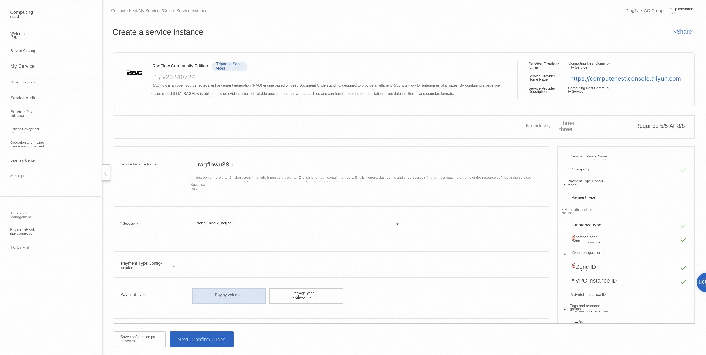
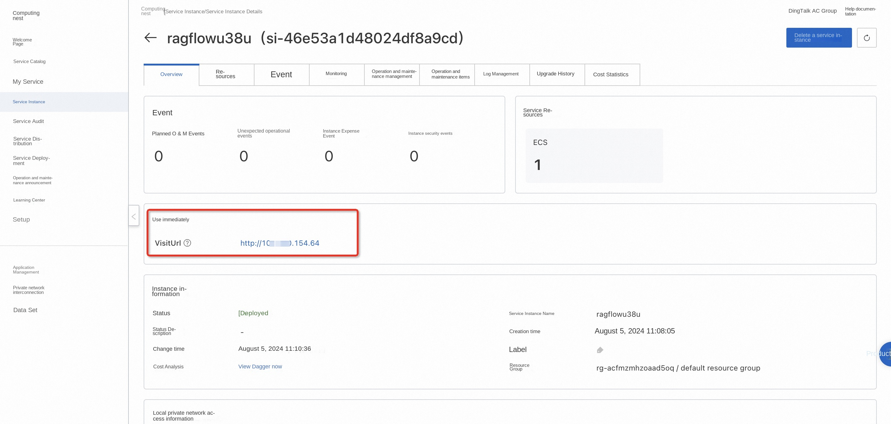
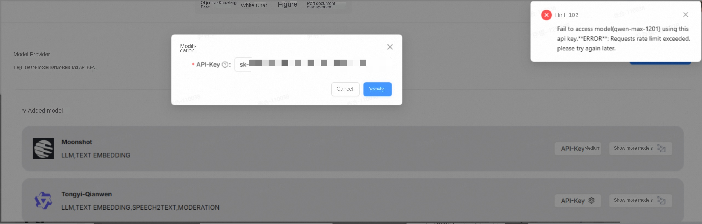
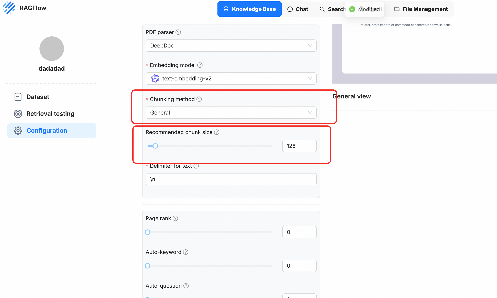

# RAGFlow Community Edition Quick Deployment

## Overview
RAGFlow is an open source RAG (Retrieval Enhanced Generation) engine based on deep document understanding. When integrated with the LLM, it is able to provide true question-and-answer functionality, supported by full references to data in a variety of complex formats. For details, please see [RAGFlow official website](https://ragflow.io).

## Billing Description
Fees on the RAGFlow Community Edition mainly relate:

-Selected vCPU and memory specifications
-System disk type and capacity
-public network bandwidth

## Permissions required for RAM accounts
To deploy RAGFlow Community Edition, you need to access and create some Alibaba Cloud resources. Therefore, your account must contain permissions for the following resources.
**Note**: This permission is required only when your account is a RAM account.

| Permission policy name | Comment |
| ------------------------------------- | ---------------------------- |
| AliyunECSFullAccess | Permissions to manage ECS instances |
| AliyunVPCFullAccess | Permissions to manage a VPC |
| AliyunROSFullAccess | Manage permissions for Resource Orchestration Service (ROS) |
| AliyunComputeNestUserFullAccess | Manage user-side permissions for the compute nest service (ComputeNest) |

## Deployment process

1. Visit the RAGFlow Community Edition Service [Deployment Link](https://computenest.console.aliyun.com/service/instance/create/cn-hangzhou?type=user&ServiceId=service-06cfae29e2e949b5900c) and fill in the deployment parameters as prompted:

2. After completing the parameters, you can see the corresponding RFQ details. After confirming the parameters, click **Next: Confirm Order**. Confirm the order and agree to the service agreement and click **Create Now** to enter the deployment phase.
3. After the deployment is completed, enter the service instance management and find the RAGFlow service access link in the console.

4. Click the link to access the service.

## Frequently Asked Questions
1. API call frequency limit for reporting errors using the general meaning thousand questions API:

Solution: Add [Ragflow official communication group](https://github.com/infiniflow/ragflow/blob/main/README_zh.md) to negotiate and modify the usage restrictions.
2. During parsing, the process crashes
Most of the time, it is due to memory explosion. You can try to increase the ECS memory or slice the General mode and lower the chunk_size!