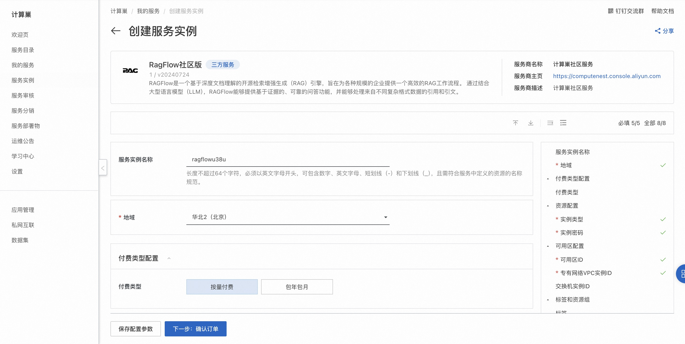
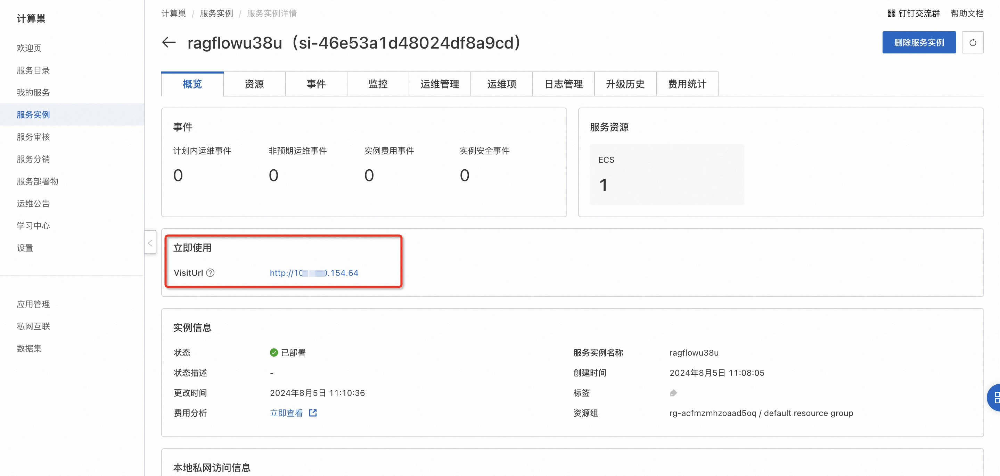
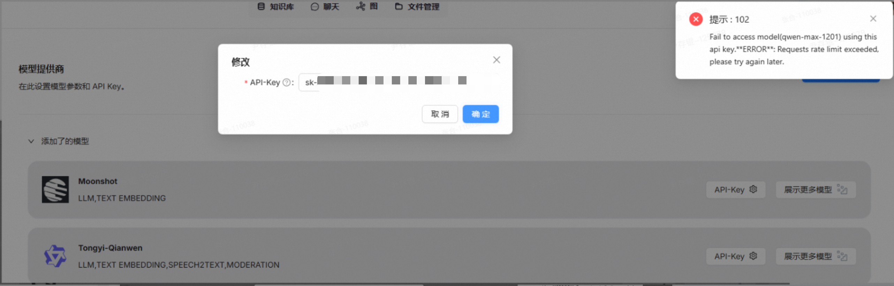

# RAGFlow 社区版快速部署

## 概述
RAGFlow是一个基于深度文档理解的开源RAG（检索增强生成）引擎。当与LLM集成时，它能够提供真实的问答功能，并得到各种复杂格式数据的充分引用的支持。 详情请查看[RAGFlow官网](https://ragflow.io)。


## 计费说明
RAGFlow 社区版上的费用主要涉及：

- 所选vCPU与内存规格
- 系统盘类型及容量
- 公网带宽


## RAM账号所需权限
部署RAGFlow 社区版，需要对部分阿里云资源进行访问和创建操作。因此您的账号需要包含如下资源的权限。
  **说明**：当您的账号是RAM账号时，才需要添加此权限。

| 权限策略名称                          | 备注                                 |
|---------------------------------|------------------------------------|
| AliyunECSFullAccess             | 管理云服务器服务（ECS）的权限                   |
| AliyunVPCFullAccess             | 管理专有网络（VPC）的权限                     |
| AliyunROSFullAccess             | 管理资源编排服务（ROS）的权限                   |
| AliyunComputeNestUserFullAccess | 管理计算巢服务（ComputeNest）的用户侧权限         |

## 部署流程

1. 访问RAGFlow 社区版服务[部署链接](https://computenest.console.aliyun.com/service/instance/create/cn-hangzhou?type=user&ServiceId=service-06cfae29e2e949b5900c)，按提示填写部署参数：
  

2. 参数填写完成后可以看到对应询价明细，确认参数后点击**下一步：确认订单**。确认订单完成后同意服务协议并点击**立即创建**进入部署阶段。 
3. 等待部署完成后进入服务实例管理, 在控制台找到RAGFlow服务访问链接。
  
4. 单击链接访问服务。
  


## API调用方式示例

<details style="border: 2px solid #2563eb; border-radius: 12px; padding: 20px; margin: 20px 0; background: linear-gradient(145deg, #f8fafc, #eff6ff); box-shadow: 0 8px 16px rgba(37, 99, 235, 0.15);">
<summary style="font-weight: bold; font-size: 18px; color: white; cursor: pointer; padding: 16px; background: linear-gradient(135deg, #2563eb, #1e40af); border-radius: 8px; margin: -20px -20px 20px -20px; text-shadow: 1px 1px 2px rgba(0,0,0,0.2); transition: all 0.3s ease; display: flex; align-items: center; box-shadow: 0 4px 8px rgba(37, 99, 235, 0.3);">
🐍 点击展开完整 Python API 调用代码
</summary>

```python 

#!/bin/bash

API_SERVER="http://xxx"
API_KEY="ragflow-ZjY2RlNG0Mm"
AGENT_ID="79663ba692cd11f0bd180242ac120006"

echo "=== RAGFlow Agent 流式对话测试 ==="

# 函数：发送流式消息
send_stream_message() {
local question="$1"
echo "问题: $question"
echo "回答:"
curl --request POST \
--url "${API_SERVER}/api/v1/agents/${AGENT_ID}/completions" \
--header 'Content-Type: application/json' \
--header "Authorization: Bearer ${API_KEY}" \
--data "{
\"question\": \"${question}\",
\"stream\": true
}"
echo -e "\n"
echo "----------------------------------------"
}

# 函数：发送非流式消息
send_message() {
local question="$1"
echo "问题: $question"
echo "回答:"
curl --request POST \
--url "${API_SERVER}/api/v1/agents/${AGENT_ID}/completions" \
--header 'Content-Type: application/json' \
--header "Authorization: Bearer ${API_KEY}" \
--data "{
\"question\": \"${question}\",
\"stream\": false
}"
echo -e "\n"
echo "----------------------------------------"
}

# 1. 基础对话测试
echo "1. 基础对话测试（流式）"
send_stream_message "你好，请介绍一下自己"

sleep 2

# 2. 功能询问
echo -e "\n2. 功能询问（流式）"
send_stream_message "你能做什么？"

sleep 2

# 3. 知识问答
echo -e "\n3. 知识问答（流式）"
send_stream_message "请介绍一下RAGFlow的主要特点"

sleep 2

# 4. 技术问题
echo -e "\n4. 技术问题（流式）"
send_stream_message "如何使用RAGFlow构建知识库？"

sleep 2

# 5. 非流式测试
echo -e "\n5. 非流式测试"
send_message "总结一下我们刚才的对话"

echo -e "\n=== 测试完成 ==="

```
</details>

## 常见问题
1. 使用通义千问API 报错API调用频率限制：
  
  解决方案：添加[Ragflow官方交流群](https://github.com/infiniflow/ragflow/blob/main/README_zh.md)协商修改使用限制。